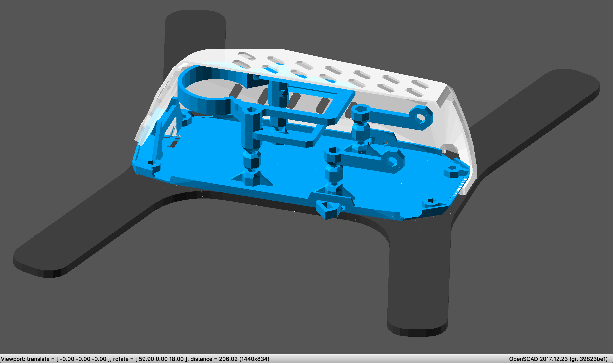
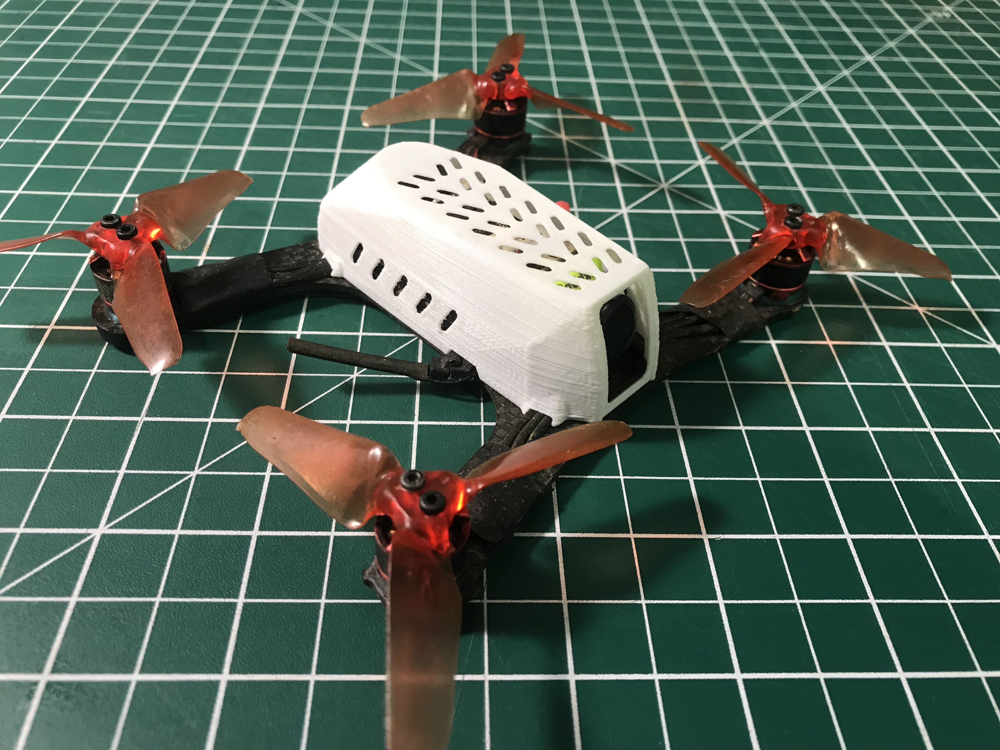

# Eachine Racer 130 mods

3D printable components to modify your Racer 130. This repository contains source files. [Ready-to-print STL files](https://www.thingiverse.com/thing:2605581 "Eachine Racer 130 3D printed replacement parts") are available on Thingiverse.

I did this because initially the stock flight controller died, and I replaced it with one with different mounting holes. Then I wanted to use a 19mm micro cam, switchable video transmitter, UXII antenna and addressable LED strip. You get the picture. All that and a full canopy comes in almost 10g less than stock!

## Dependencies

Requires [BH Lib](https://github.com/brandonhill/BH-Lib). Checkout to adjacent directories to avoid having to change `include` paths.

## Components

* [5.8GHz UXII antenna](https://www.banggood.com/Realacc-UXII-Stubby-RHCP-U_FLIPEX-IPX-5_8GHz-1_6dBi-Super-Mini-Antenna-For-TX-RX-Fatshark-Goggles-R-p-1256043.html?p=82221313786612015035)
* [48ch 0/25/100/200mW video transmitter](https://www.banggood.com/EWRF-e7092TM-5_8G-48CH-25mW100mW200mWOFF-Power-Adjustable-AIO-VTX-FPV-Transmitter-Support-SBUS-p-1260331.html?p=82221313786612015035)
* [FrSky XM+ 16ch micro receiver](https://www.banggood.com/Frsky-XM-Micro-D16-SBUS-Full-Range-Receiver-Up-to-16CH-p-1110020.html?p=82221313786612015035)
* 20x20 flight controller [Nox F4 flight controller](https://www.banggood.com/20x20mm-Betaflight-F4-Noxe-MPU6000-Flight-Controller-AIO-OSD-5V-BEC-Built-in-LC-Filter-for-RC-Drone-p-1310419.html?p=82221313786612015035)
* 20x20 4 in 1 ESC [HakRC 15A](https://www.banggood.com/Hakrc-20x20mm-15A-Blheli_S-BB2-2-4S-Dshot-4-In-1-ESC-for-Racing-Drone-p-1165086.html?p=82221313786612015035)
* 19mm micro cam [RunCam Swift Micro 1/3" CCD camera](https://www.banggood.com/RunCam-Micro-Swift-600TVL-2_1mm-2_3mm-IR-Blocked-CCD-FPV-Camera-PAL-NTSC-5_6g-p-1144546.html?p=82221313786612015035) or [Caddx Turbo Micro 1/3" CMOS camera](https://www.banggood.com/Caddx-Turbo-Micro-F2-13-CMOS-2_1mm-1200TVL-16943-NTSCPAL-Low-Latency-FPV-Camera-W-Microphone-p-1328481.html?p=82221313786612015035)
* [WS2812B 4x LED Strip](https://www.banggood.com/Super-Mini-WS2812B-RGB5050-4-Bit-Colorful-LED-Strip-for-Naze32-F3-F4-Flight-Control-p-1152572.html?p=82221313786612015035)
* [XT30 connector(s)](https://www.banggood.com/5-Pairs-XT30-2mm-Golden-Male-Female-Non-slip-Plug-Interface-Connector-p-1237676.html?p=82221313786612015035)
